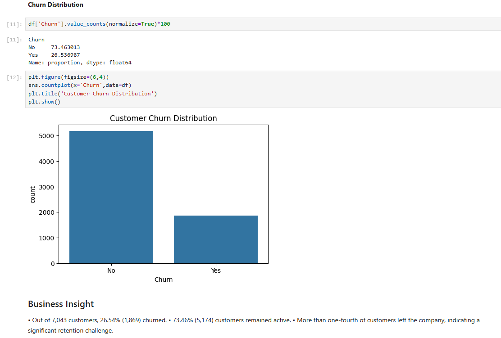
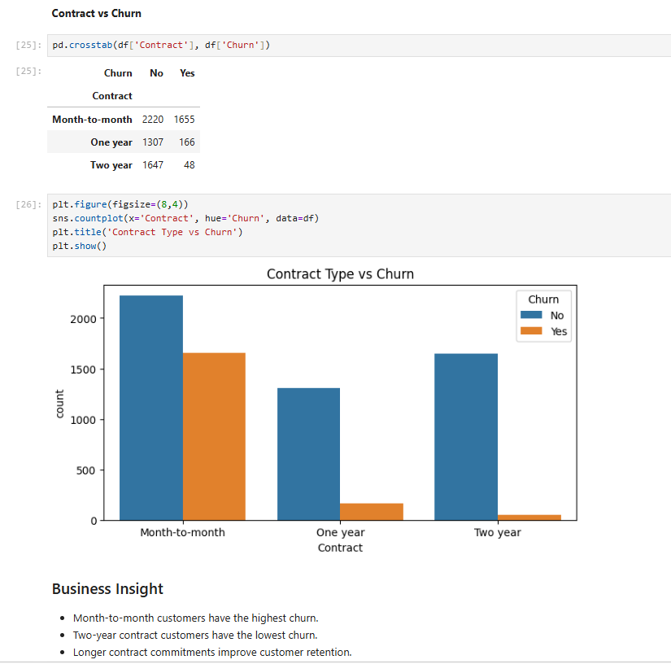
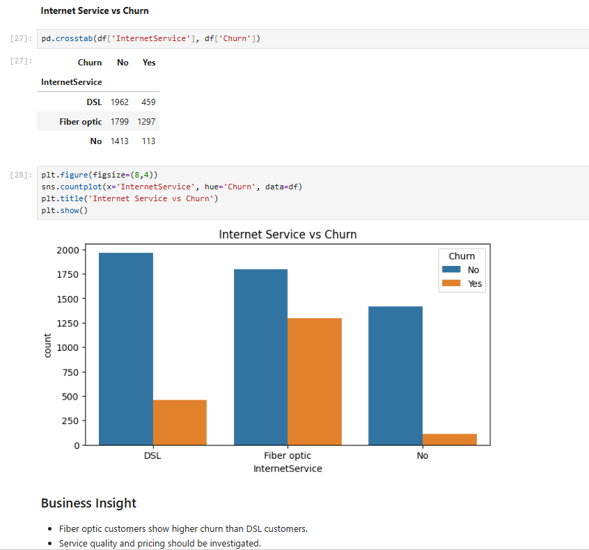
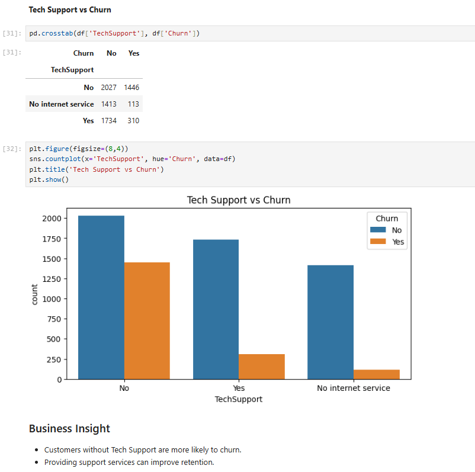
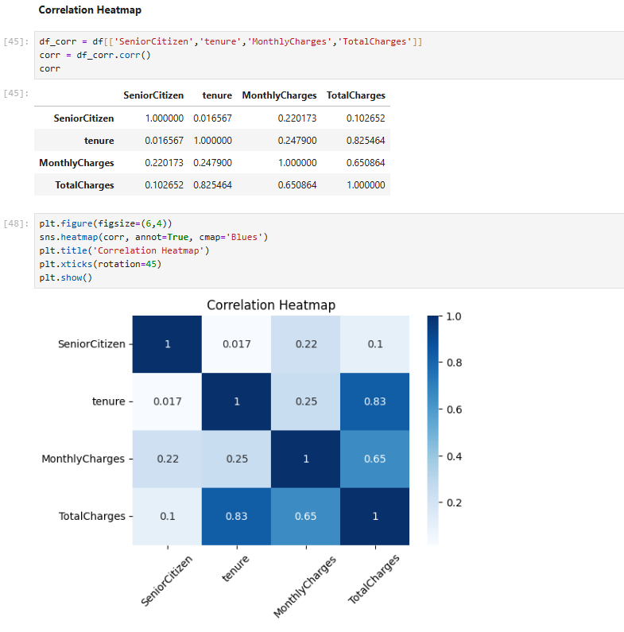
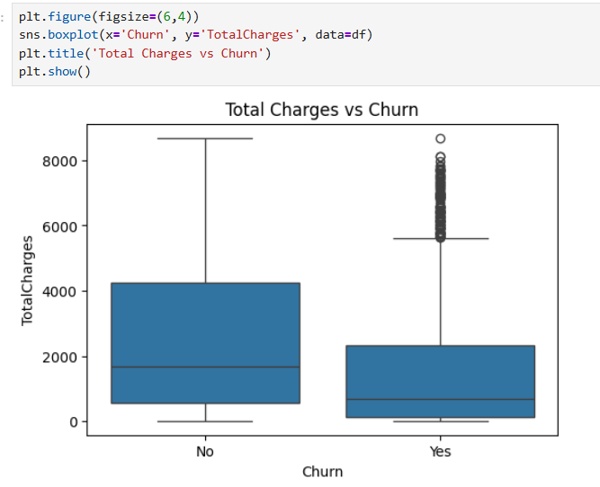

# Telco Customer Churn Analysis using Python

## Project Overview

This project performs Exploratory Data Analysis (EDA) on the Telco Customer Churn dataset to identify customer retention patterns, churn drivers, service usage behavior, and revenue-related insights. The objective is to help telecom companies understand why customers leave and provide data-driven recommendations to improve retention.

---

## Business Problem

Customer churn is one of the major challenges faced by telecom companies. Losing customers directly impacts revenue and profitability.

This project analyzes customer demographics, services, contracts, payment methods, and revenue metrics to identify the factors contributing to customer churn.

---

## Project Objectives

- Analyze customer churn patterns.
- Identify high-risk customer segments.
- Understand the impact of contract types on churn.
- Evaluate service-related factors influencing churn.
- Analyze customer tenure and revenue contribution.
- Generate actionable business recommendations.

---

## Dataset Information

**Dataset:** Telco Customer Churn Dataset

**Total Records:** 7,043 Customers

**Features Include:**

- Customer Demographics
- Contract Information
- Internet Services
- Payment Methods
- Monthly Charges
- Total Charges
- Customer Churn Status

---

## Tools & Libraries Used

- Python
- Pandas
- NumPy
- Matplotlib
- Seaborn
- Jupyter Notebook

---

## Data Cleaning Performed

- Checked dataset structure and dimensions.
- Verified data types.
- Identified missing values.
- Converted TotalCharges from object to numeric.
- Replaced missing TotalCharges values using median imputation.
- Verified dataset consistency before analysis.

---

## Exploratory Data Analysis

### Customer Analysis

- Churn Distribution
- Gender Distribution
- Senior Citizen Distribution

### Contract Analysis

- Contract Type Distribution
- Contract Type vs Churn

### Service Analysis

- Internet Service Distribution
- Internet Service vs Churn
- Tech Support vs Churn

### Billing Analysis

- Payment Method Distribution
- Payment Method vs Churn

### Numerical Analysis

- Monthly Charges vs Churn
- Tenure vs Churn
- Total Charges vs Churn
- Correlation Heatmap

---

## Key Visualizations

### Customer Churn Distribution



### Contract Type vs Churn



### Internet Service vs Churn



### Tech Support vs Churn



### Correlation Heatmap



### Total Charges vs Churn



---

## Business Insights

### Customer Churn

- 26.54% of customers churned.
- 73.46% of customers remained active.

### Contract Analysis

- Month-to-Month customers have the highest churn rate.
- Two-Year contract customers show the strongest retention.

### Internet Service Analysis

- Fiber Optic customers exhibit higher churn compared to DSL customers.
- Customers without internet service show relatively low churn.

### Tech Support Analysis

- Customers without Tech Support are significantly more likely to churn.
- Tech Support positively influences customer retention.

### Payment Method Analysis

- Electronic Check customers show the highest churn behavior.
- Automatic payment methods demonstrate better retention.

### Revenue Analysis

- Customers with longer tenure contribute higher revenue.
- Churned customers generally have lower Total Charges.

### Senior Citizen Analysis

- Senior Citizens show relatively higher churn behavior than non-senior customers.

---

## Business Recommendations

1. Promote long-term contracts through loyalty programs.
2. Encourage adoption of Tech Support services.
3. Improve onboarding experience for new customers.
4. Focus retention campaigns on Fiber Optic users.
5. Reduce churn among Electronic Check customers.
6. Identify and proactively engage high-risk customer segments.

---

## Project Structure

```text
Telco-Customer-Churn-Analysis-Python
│
├── README.md
├── Business Requirements Document.md
├── Telco Customer Churn Analysis using Python.ipynb
├── telco_customer_churn_data.csv
└── Images
    ├── churn_distribution.png
    ├── contract_vs_churn.png
    ├── internet_service_vs_churn.png
    ├── tech_support_vs_churn.png
    ├── correlation_heatmap.png
    └── total_charges_vs_churn.png
```

---

## Conclusion

The analysis reveals that contract type, internet service, tech support availability, payment methods, and customer tenure significantly influence churn behavior. These insights can help telecom companies design targeted retention strategies and improve customer lifetime value.

---

### Author

**Bhuvaneswari**
Data Analytics Portfolio Project
